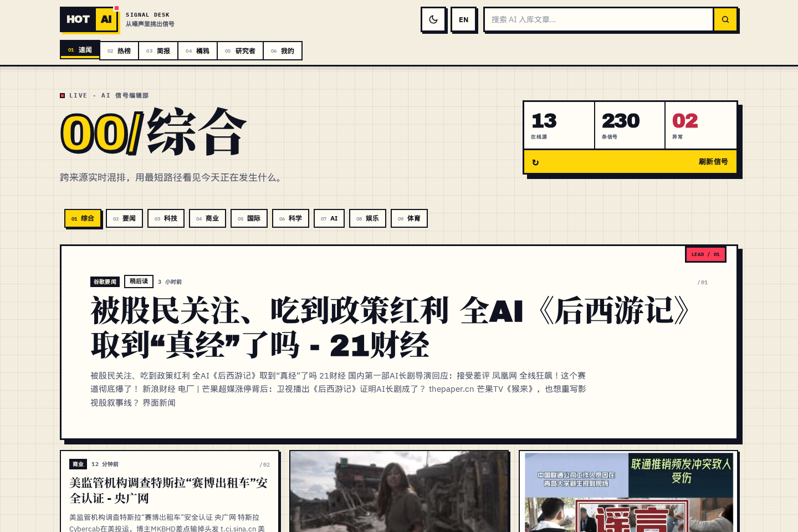
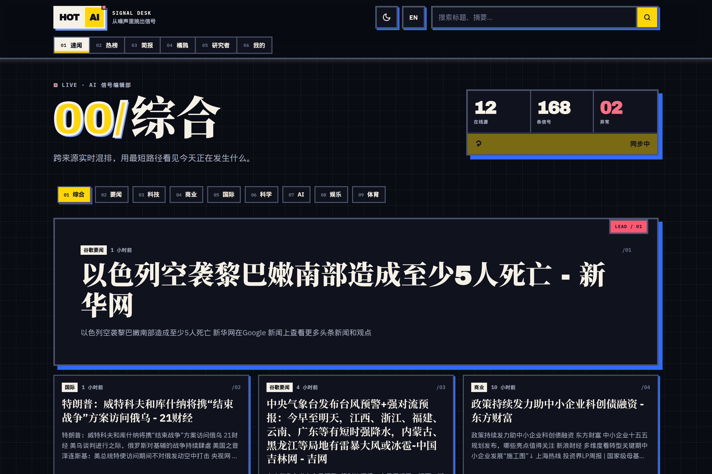
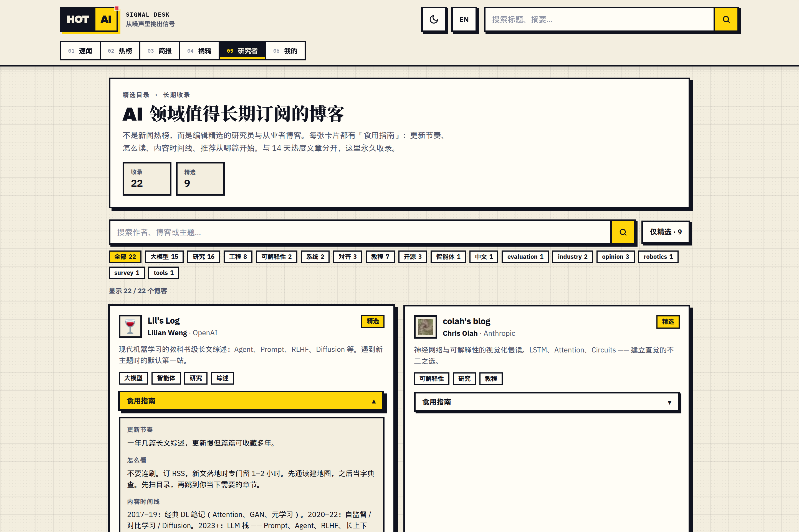
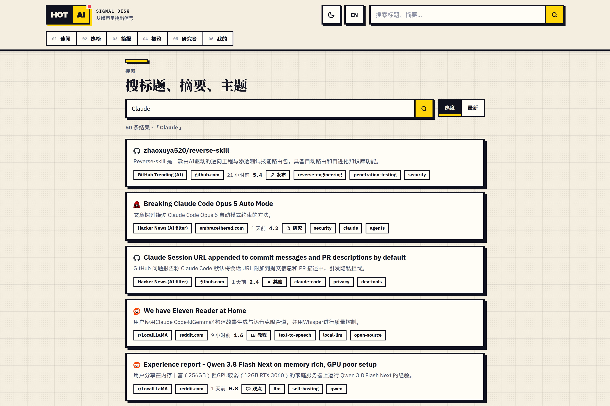
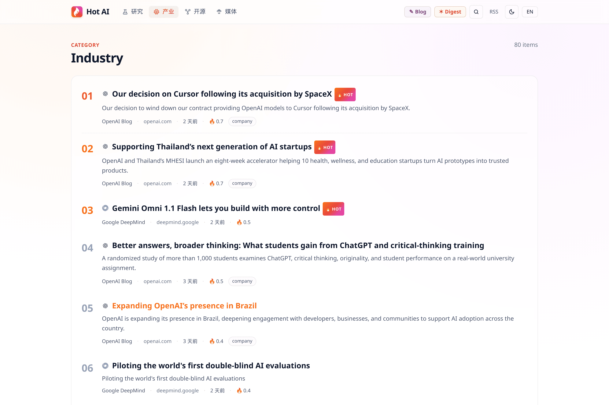

# Hot AI

NewsNook 式多源速闻阅读器；Hot AI（打分热榜 / 简报 / 问答）作为其中一块模块。数据源涵盖谷歌要闻、BBC、科技媒体，以及 fetcher 聚合的 AI 行业源。

生产站 [`https://hotai.yeuxark.com`](https://hotai.yeuxark.com)。

## 产品预览

截图来自一次真实的本地抓取 + 前端运行。首页已改为 NewsNook 式「速闻」时间线，热榜移到 `/hot`；下面几张是改版前的热榜 / 博客 / 搜索界面。

<p align="center">
  
</p>
<p align="center"><sub>热榜（现入口 `/hot`）：来源权重 × 时间衰减 × 信号 × AI 重要度</sub></p>

<table>
  <tr>
    <td align="center" width="50%">
      
      <br /><sub>暗色模式</sub>
    </td>
    <td align="center" width="50%">
      
      <br /><sub>精选博客目录，卡片可展开阅读指南</sub>
    </td>
  </tr>
  <tr>
    <td align="center" width="50%">
      
      <br /><sub>标题 / 摘要 / 标签检索</sub>
    </td>
    <td align="center" width="50%">
      
      <br /><sub>按分类浏览：OpenAI、DeepMind 等产业动态</sub>
    </td>
  </tr>
</table>

## 产品预览

截图来自一次真实的本地抓取 + 前端运行（未配置 AI key，故无 Claude 摘要 / 简报；热度榜与博客目录本身可完整使用）。

<p align="center">
  
</p>
<p align="center"><sub>首页：今日热度榜，按来源权重 × 时间衰减 × 信号实时排序</sub></p>

<table>
  <tr>
    <td align="center" width="50%">
      
      <br /><sub>暗色模式</sub>
    </td>
    <td align="center" width="50%">
      
      <br /><sub>精选博客目录，卡片可展开阅读指南</sub>
    </td>
  </tr>
  <tr>
    <td align="center" width="50%">
      
      <br /><sub>全文搜索（标题 / 摘要 / 标签）</sub>
    </td>
    <td align="center" width="50%">
      
      <br /><sub>按分类浏览：OpenAI、DeepMind 等产业动态</sub>
    </td>
  </tr>
</table>

## 架构

```
apps/web        Next.js 16。默认「速闻」直连多源 RSS 混排；`/hot` 才是 Hot AI 热榜模块；站内阅读 + /api/ask
apps/fetcher    Node.js worker — 每小时抓取 / 去重 / 打分 / AI 摘要 / 生成今日简报
packages/db     共享 Prisma client 和 schema (含 Article.ai* 字段 + Digest 表)
packages/ai     Anthropic SDK 封装 — enrichArticle / generateDigest / 流式客户端
```

首页是 NewsNook 式时间线（分类轨、大量条目、站内读原文）；Hot AI 热榜 / 简报 / Ask 在「热榜」「简报」里。视觉对齐 [KAZAM](https://music.yeuxark.com)。

数据流：`fetcher` 负责文章、来源健康和 AI 字段写入；`web` 仍会在首访缺少当日简报时
生成并缓存 Digest，并为 `/api/ask` 写入问答缓存。每轮抓取结束后 fetcher 调
`/api/revalidate` 刷新 Next.js ISR 缓存。自定义源只存在访问者 localStorage，不入库、不进热榜。
AI 字段为可选 —— 不配置 `ANTHROPIC_AUTH_TOKEN` / `ANTHROPIC_API_KEY` 时全站功能正常，
只是没有摘要、简报和问答。

## 本地开发

```bash
# 1) 准备 Postgres (Docker)
docker run -d --name hotai-pg -p 5432:5432 \
  -e POSTGRES_USER=hotai -e POSTGRES_PASSWORD=hotai -e POSTGRES_DB=hotai \
  postgres:15

# 2) 安装依赖
pnpm install

# 3) 复制环境变量,并(可选)填入 ANTHROPIC_AUTH_TOKEN(或 ANTHROPIC_API_KEY)
cp .env.example .env

# 4) 生成 Prisma 客户端 + 建表 + 灌入来源
pnpm db:generate
pnpm db:migrate          # 应用仓库中已提交的 Prisma migrations
pnpm db:seed

# 5) 手动跑一次抓取(顺带触发 AI 摘要 + 生成今日简报)
pnpm fetch:once

# 6) 启动前端
pnpm dev:web             # http://localhost:3000
```

## 页面 / 接口

| 路径                 | 说明                                              |
| -------------------- | ------------------------------------------------- |
| `/`                  | 速闻：多源 RSS 按时间混排（分类轨，可一次刷上百篇） |
| `/hot`               | Hot AI 模块：最近 14 天入库热榜 + 今日脉搏          |
| `/digest`            | 今日 AI 简报 + AskBox                             |
| `/juya`              | 橘鸦 AI 早报（daily.juya.uk RSS，不入库）         |
| `/r`                 | 速闻条目的站内阅读（Readability，不入库）         |
| `/a/[id]`            | 热榜条目站内阅读（AI 摘要 + 正文）                |
| `/search?q=…`        | 标题 / 摘要 / 主题标签检索（当前为子串匹配）    |
| `/category/{slug}`   | 分类时间线（publishedAt：research / industry / opensource / media） |
| `/source/{slug}`     | 单源时间线                                        |
| `/blogs`             | 精选博客目录                                      |
| `/subscribe`         | 本机自定义源 + OPML 导入导出（不入库）            |
| `/feed.xml`          | RSS 2.0（优先 AI 摘要，无 AI 时回退源摘要）       |
| `/feed.json`         | JSON Feed 1.1                                     |
| `/hotai.opml`        | 编辑源 + 博客 OPML                                |
| `/api/ask`           | POST — Claude 流式问答 (SSE),基于过去 48h 文章；引用可回到站内 |
| `/api/digest`        | GET  — 今日简报 JSON                              |
| `/api/readability`   | POST `{url}` — 抽取正文（SSRF 防护）              |
| `/api/proxy/feed`    | GET `?url=` — 代理用户自建源（不入库）            |
| `/api/catalog/pull`  | POST `{ids}` — 速闻 live RSS（不入库）            |
| `/api/revalidate`    | POST — fetcher 用,需 `x-revalidate-secret`       |
| `/api/live`          | GET — Web 进程 liveness（不访问 DB）             |
| `/api/health`        | GET — DB/readiness、抓取新鲜度、AI/Ask 聚合状态  |
| `/api/metrics`       | GET — Prometheus 指标，需 `OBSERVABILITY_TOKEN`  |

## AI 流水线

每个 fetch cycle 结束后:
1. `enrichPendingArticles()` 从 `pending/retry/过期 processing` 状态中按热度认领 top-N 条，
   用数据库 lease + `aiAttempts` CAS 避免多 worker 重复消费，再用 `LLM_MODEL_FAST`
   批量生成中英摘要、主题、类型和重要度。失败按指数退避重试，连续 6 次失败才进入
   `failed`；成功写回 `Article.ai*` 并重新计算热度分。
2. `ensureTodayDigest()` 取当日 top-40,用 `LLM_MODEL_SMART` 生成 headline / overview /
   bullets,写入 `Digest`。Web 首访兜底和 fetcher 共用 PostgreSQL 协调 lease，跨进程只允许
   一个生成者；崩溃后按 TTL 自动恢复，同日内 6 小时内不重复刷新。

调整 `AI_ENRICH_PER_RUN` / `AI_BATCH_SIZE` / `AI_CONCURRENCY` 控制成本与延迟。

`/api/ask` 先使用单 IP 限流和答案缓存；相同问题的并发 miss 由 PostgreSQL 协调租约合并，
再原子预约每日 token 预算与全局并发槽。答案缓存同时保存引用来源快照，避免热榜重排后
`[n]` 指向另一篇文章。`ASK_DAILY_TOKEN_LIMIT`、`ASK_MAX_CONCURRENT` 和
`ASK_RESERVATION_TTL_SECONDS`（低于 300 秒会被钳制）分别控制日预算、跨 Web 进程并发和崩溃预约回收；数据库
不可用时该成本阀 fail-closed，不会绕过配额继续调用模型。

`/api/proxy/feed`、`/api/readability`、`/api/catalog/pull` 的 IP 计数也保存在 PostgreSQL；
多 Web 实例共享窗口和容量上限，数据库不可用时返回 503，而不是退化为无限制抓取。

## 健康与指标

- `/api/live`：只验证 Web 进程仍能响应，适合作为 liveness。
- `/api/health`：检查数据库、最近抓取时间、Source 状态、AI lease、Digest、Ask quota 和
  Fetcher cycle lease；内容管线超过 `HEALTH_MAX_FETCH_AGE_SECONDS` 未更新时返回 503。
- `/api/metrics`：Prometheus 文本格式；默认关闭。设置至少 32 字节随机
  `OBSERVABILITY_TOKEN` 后，以 `Authorization: Bearer <token>` 抓取。

### 用中转站 / 自建 proxy（显式 opt-in）

代码用的是 `@anthropic-ai/sdk`,只走 Anthropic 的 `/v1/messages` 协议 —— 任何
**实现了同协议** 的中转站都能直接用,无需改代码:

```ini
ANTHROPIC_AUTH_TOKEN=""                        # Bearer 鉴权；只填一种凭据
ANTHROPIC_API_KEY=""                           # 直连 Anthropic 或 X-Api-Key 中转
ANTHROPIC_BASE_URL=""                          # 留空 = 官方 Anthropic 端点
ALLOW_THIRD_PARTY_AI="false"                   # 非官方域名必须显式改为 true
ALLOW_INSECURE_AI_HTTP="false"                 # 仅本机开发可考虑开启
LLM_MODEL_FAST="claude-haiku-4-5"             # 改成中转站实际接受的 ID
LLM_MODEL_SMART="claude-sonnet-4-6"
AI_PROMPT_CACHE="false"                       # 多数中转站不支持 cache_control,关掉
```

复制 `.env.example` 后 AI 默认保持关闭。只有在确认数据处理方、TLS 和密钥归属后，
才设置 `ALLOW_THIRD_PARTY_AI=true` 并填写中转站；同时配置 token 与 API key 会被拒绝。

本仓库走 Anthropic `/v1/messages` 协议；`ANTHROPIC_AUTH_TOKEN` 使用 Bearer 鉴权，
`ANTHROPIC_API_KEY` 使用 `X-Api-Key` 鉴权。

## 美术资产

当前站点已使用 Signal Press 视觉资产：`icon.svg`、`logo.svg`、favicon、PNG
图标族、`og-zh.png`、`404-flameout.svg` 以及分类/情绪图标均位于
`apps/web/public/`。资产规格、运行时引用和仍属可选的素材见
[`docs/ART_REQUIREMENTS.md`](docs/ART_REQUIREMENTS.md)；如需重生成图标与 OG 图，
运行 [`scripts/generate_signal_assets.py`](scripts/generate_signal_assets.py)。

## 设计 / 路线图

整体逻辑详解、痛点自查、优化 + 扩展方案、按 ROI 排序的 sprint 清单见
[`docs/design.md`](docs/design.md)。阅读壳规格见 [`docs/nook-merge.md`](docs/nook-merge.md)。
改任何核心模块前请先翻一下,避免重复踩坑。

## 生产部署

见 `deploy/` 目录:

```bash
bash deploy/setup.sh
sudo cp deploy/nginx.conf /etc/nginx/sites-available/hotai
sudo ln -s /etc/nginx/sites-available/hotai /etc/nginx/sites-enabled/
sudo certbot --nginx -d hotai.yeuxark.com
sudo cp deploy/nginx-https.conf /etc/nginx/sites-available/hotai
sudo nginx -t && sudo systemctl reload nginx
pm2 start ecosystem.config.js
pm2 save && pm2 startup
```
