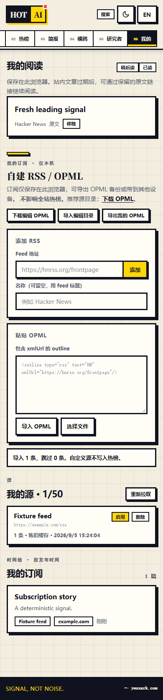

# Hot AI 项目整改验收报告

日期：2026-09-05。基线：`1a8f819`，依据 `PROJECT_AUDIT_2026-09-05.md` 的 25 项发现。详细执行顺序与逐项对应关系见 `MATURITY_PLAN_2026-09-05.md`；当前规格见 `CURRENT_BEHAVIOR.md`。

## 结论

25 项审计发现均已落地整改，并完成本机验证。项目补齐了阅读保存与取回、刷新与搜索状态、分页、故障与缓存区分、AI 并发保护、来源自动恢复、移动端与双语体验、发布门槛以及持续回归测试。

本次交付是经过本机生产构建和隔离数据库验收的代码版本。未提交或推送 Git，未迁移现有项目数据库，未部署线上服务，未调用付费模型。线上稳定性和实际模型回答质量仍需在目标部署环境验收，不能由一次本机测试代替。

## 分领域交付

| 领域 | 整改结果 | 关键证据 |
|---|---|---|
| 核心可用性 F01/F02/F11/F25 | 服务故障与源故障分开；陈旧缓存标注时间；主动刷新可以置顶；内容页面动态化；发布检查失败会阻止放行 | catalog 路由回归、浏览器刷新/故障用例、真实停库恢复演练 |
| 阅读闭环 F04/F05/F07/F16 | 统一阅读目标；原文 URL + 可选 Article ID；我的阅读列表、已读/稍后读徽标、旧数字记录迁移；写入失败明确提示 | 热榜与订阅阅读路径、刷新后取回、QuotaExceededError 模拟 |
| 交互与查询 F03/F06/F08/F09/F10/F15 | 手机表单顺序正确、原生文件按钮、SSE 完成校验、搜索跟随提交参数、搜索与分类/来源分页、明确检索范围 | 断包/CRLF/EOF 测试；Enter 导入；86 篇测试数据检查 60/80 条分页及浏览器后退 |
| AI 与后台 F12/F13/F14 | Ask 缓存绑定语料版本；Digest 心跳和事务提交核验；失败来源定时重试、人工停用保持停用 | 路由检查语料变化；真实 DB 拒绝旧 owner 提交；心跳与 Source 恢复集成测试 |
| 状态与时间 F17/F19 | 实时目录独立状态、低基数指标、合成探测；UTC 编辑日和北京时间换日说明 | 冷缓存 unknown 测试；Hacker News 真实探测；BBC 超时准确报告为降级 |
| 前端与维护 F18/F20/F21/F22/F23 | 服务器可读语言 cookie；手机收起搜索和导航定位；行为合同；样式职责拆分；清理无引用组件；SEO 描述与索引校准 | 英文服务器 HTML、390 px 浅/深色截图、119 px 页头、类型/Lint/构建检查 |
| 持续质量 F24 | 确定性 Chromium 用户路径脚本、API 路由测试、真实 PostgreSQL 测试和 CI 证据上传 | 207 项测试、10 条生产浏览器路径通过；CI 配置已更新 |

## 最终自动验证结果

验证环境为 Windows、Node **22.22.2**、pnpm **9.12.0**、隔离 PostgreSQL **16**、Chromium **153**。最初系统默认 Node 24，最后一次正式验收改用项目声明的 Node 22。CI 配置目标为 Ubuntu、Node 22.22.2、PostgreSQL 15；远程 CI 本次未触发。

| 检查 | 结果 |
|---|---|
| Prisma migrations | 全部 **9** 个迁移成功应用到新建测试库，包括新增来源恢复字段 |
| `pnpm test`，`RUN_DB_TESTS=1` | **51 个测试文件，207 项通过，0 跳过、0 失败** |
| `pnpm typecheck` | DB、AI、fetcher、web 全部通过 |
| `pnpm lint` | 通过，0 warning；最后的 ref 写法问题已修复 |
| `pnpm build` | 生产构建通过；DB 内容路由均显示动态渲染 |
| 编译后的 fetcher smoke | `compiled dist smoke passed` |
| `pnpm smoke:browser` | **10 条用户路径通过，0 未捕获浏览器错误** |
| `pnpm release:check`，健康测试库 | 所有迁移、启用来源、近期文章检查通过 |
| `pnpm release:check`，不可达数据库端口 | 按预期返回非零退出码，未虚报发布就绪 |
| 带 `RELEASE_BASE_URL` 的运行检查 | 入库健康及真实 RSS 通路检查通过；允许部分上游故障并显示降级 |
| `git diff --check` | 通过 |

浏览器十条路径为：主动刷新重排、远程阅读保存取回、手机表单与键盘 OPML、搜索分页及后退、分类/来源分页及入库文章保存、回答断流、英文 SSR、服务故障下的缓存、手机深色与页面宽度、浏览器存储失败。

## 真实故障演练

使用本次创建的 `hotai-maturity-test-db`，仅绑定本机 `127.0.0.1:55432`，库名 `hotai_test`。测试前核对容器完整 ID；未访问根目录 `.env` 指向的数据库。

1. 生产进程读取 86 篇确定性测试文章，热榜和健康接口正常。
2. 通过项目实际 SSRF 保护与代理链拉取 Hacker News，获得 **20** 条新鲜内容。BBC Tech 在本机网络连接超时，健康状态明确为 `degraded`，没有将它计为成功。
3. 短暂停止测试数据库：热榜展示内容服务不可用；catalog 返回 **HTTP 200 + degraded=service + stale=true** 的原有安全缓存，不启动未受限的新抓取。
4. 重启同一个测试数据库：同一生产 Web 进程重新显示热榜，无须重建或重启 Web。
5. 测试服务已关闭；保留测试数据以便复现，测试容器停止后不占用运行资源。

机器可读证据：`screenshots/maturity-browser-results.json`、`screenshots/maturity-release-recovery.json`。浏览器截图采用受控语料并阻断外部图片和字体，不代表真实新闻样本或性能基准。

## 视觉与交互验收

390 × 740 视口下页头实测 **119 px**，审计时约 167.7 px，减少约 **29%**。搜索仍可通过原生按钮展开并聚焦；导航后及窗口缩窄后当前场景保持可见。订阅表单中 Feed 地址位于名称前，文件按钮可用 Enter 触发。

保留既有奶油纸色、黄色、墨色和深色蓝影；统一阅读列表、原文入口和状态提示。截图已人工检查，深色截图等待主题过渡结束后采集，页面没有横向溢出。

桌面热榜截图：`screenshots/maturity-hot-desktop.png`。

## 上线与保留的边界

- **新增迁移必须先应用。** `20260905000000_source_recovery` 只新增可空字段；旧版手动/自动停用无法可靠区分，因此现有 `enabled=false` 保持不动，运营核实后再恢复。
- **数据库仍是公开请求限流依赖。** DB 故障时只复用已有且未超出 45 分钟窗口的安全缓存；冷启动或缓存过期时仍返回不可用。跨实例缓存不共享，这一边界已写入行为合同。
- **外部来源并非全部可达。** 本机验证中 Hacker News、IT之家、少数派可以拉取，BBC Tech 超时。目标部署网络应运行合成探测并监控部分降级；不能把任何一次成功当成全部来源永久健康。
- **本机记录有存储边界。** 浏览器清理会删除记录；新快照保留原文 URL，但已经过期的老版数字书签无法自动找回原文。原站撤稿也不在站内保留能力内。
- **分页有上限。** 搜索每页 60，分类/来源每页 80，最多 1000 页；热榜维持 top 50。没有伪造总命中数，也没有将有界列表宣称为完整档案库。
- **真实 AI 质量和线上容量待部署验收。** 本次验证了配额、语料、协议、并发和失败路径；未付费调用模型，也未执行线上负载测试或远程发布。应在预发布环境用少量真实语料检查摘要、引用、耗时和费用，然后再切换流量。

建议发布顺序：备份 → 安装锁定依赖 → 迁移 → seed/抓取 → 检查与构建 → `release:check` → 启动候选服务 → 带 `RELEASE_BASE_URL` 再跑 gate → 通过后切流量。完整操作见 `deploy/README.md`。
